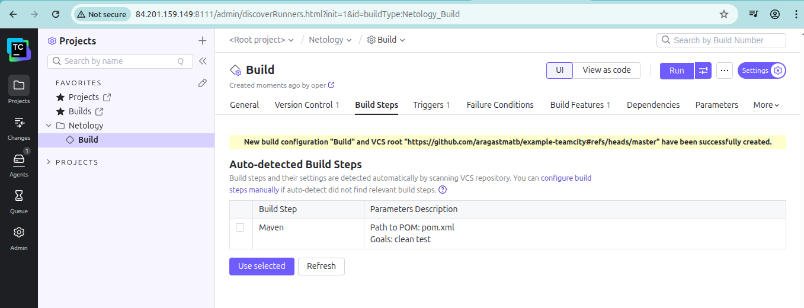

# Домашнее задание к занятию 11 «Teamcity» -- Байков Михаил

## Подготовка к выполнению
1. Созданы две ВМ на основе имиджей `jetbrains teamcity-server/agent` плюс ВМ `nexus`
   
2. Создан форк репозитория с домашним заданием по `teamcity`
   
## Основная часть
1. Создан новый проект `Netology`, подключен `vcs root`, проведен `autodetect configuration`.
   
   
  
3. Проведен билд `master`
   

4-7. Конфигурация изменена для сборки по ветке `master` и всех остальных. Артефакт появился в `nexus`.
   
   

8. Конфигурация смигрирована в репозиторий.
   

9-13. Дописан метод welcomer.sayHunter и тесты к нему, ветка `feature/say_hunter` смержена в `master`, не с первого раза, но сборка прошла(необходимо было поднять версию приложения).
   

14-17. Внесены изменения в конфигурацию для сохранения артефактов сборки. Сборка успешно прошла, артефакт присутствует.
   
   
