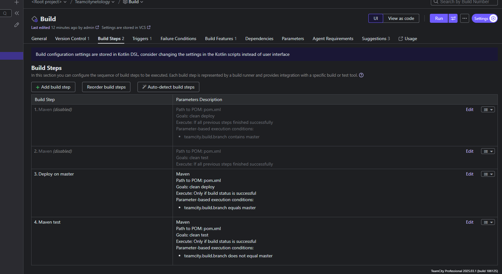
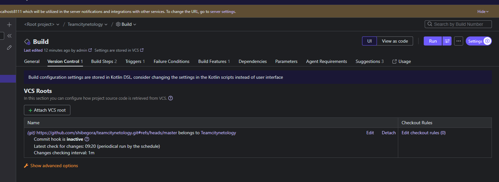
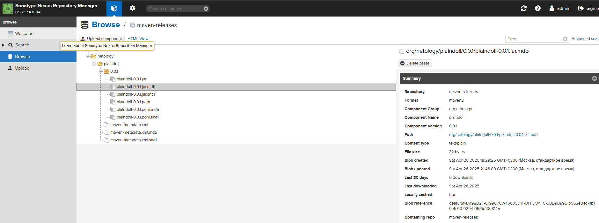
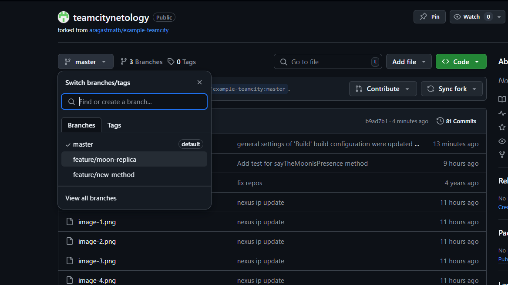
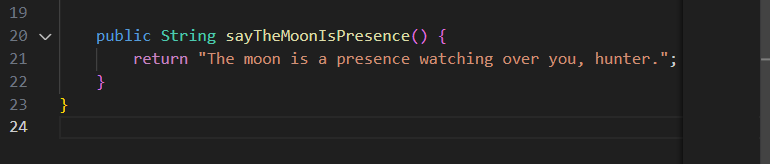
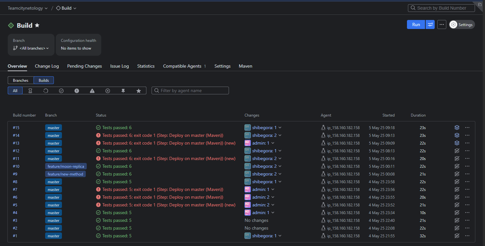
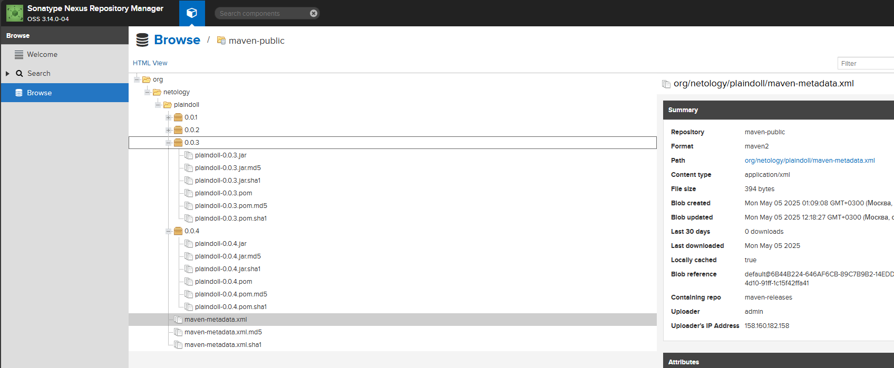

# Домашнее задание к занятию 11 «Teamcity»

Авторизованный Teamcity agent

Автоматически распознанные Build Steps

Сборка с версией 0.0.1 прошла успешно

Так же файлы загрузились в nexus

Создана отдельная ветка

Метод welcomer описан в файлах java.

Сборка и запуск происходит автоматически после публикации в гите. Постоянно забывал поменять версию в pom.xml, не хотел включать перезаписывание, поэтому грузил каждый раз новый для истории

В nexus все версии так же корректно выгружа

По умолчанию артифакт не записывается в teamcity. Для его записи был прописан Artifact paths: target/*.jar => jars, после чего он так же начал выгружаться и в teamcity

